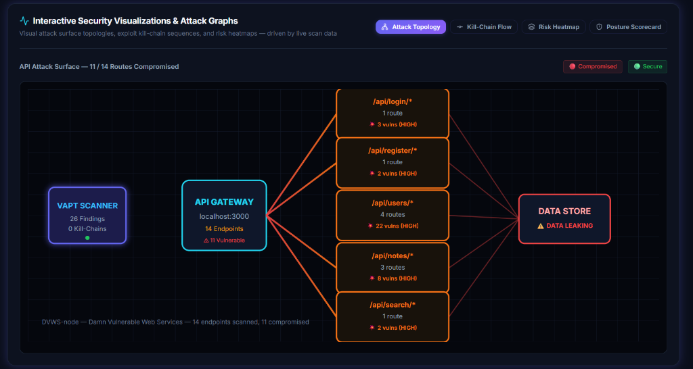
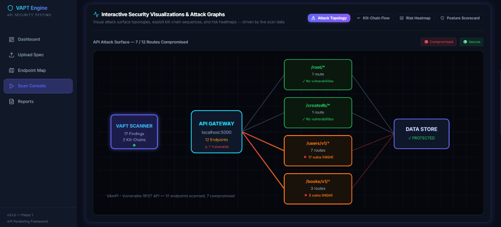
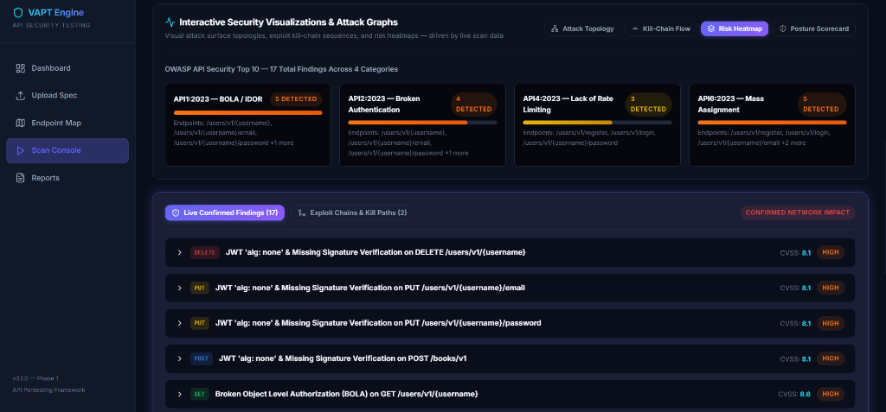
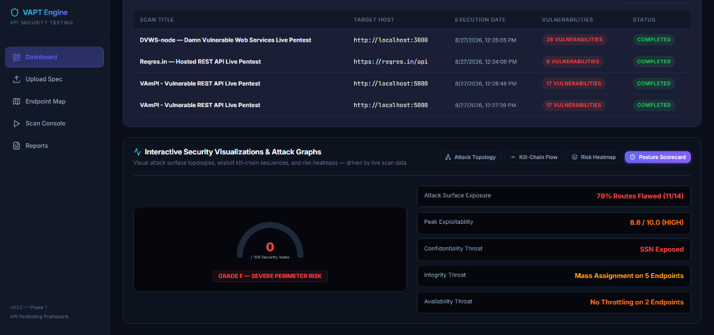

<div align="center">

# Automated VAPT Framework for Web APIs

**Spec-Aware Vulnerability Assessment & Penetration Testing Engine**

[](https://python.org)
[](https://fastapi.tiangolo.com)
[](https://react.dev)
[](https://owasp.org/API-Security/)
[](LICENSE)

An automated, spec-aware security assessment framework that ingests **OpenAPI/Swagger** specifications, maps API attack surfaces, executes targeted dynamic exploits across **OWASP API Security Top 10** vulnerabilities, correlates multi-stage exploit chains, persists historical audit records, and generates **CVSS v3.1** scored penetration testing deliverables.

[Getting Started](#-quick-start) · [Architecture](#-system-architecture) · [Attack Modules](#-active-vulnerability-audit-modules) · [Sample Library](#-sample-specification-library) · [Documentation](#-documentation)

</div>

---

## Table of Contents

- [Technical Overview](#technical-overview)
- [System Architecture](#system-architecture)
- [Screenshots & Visualizations](#screenshots--visualizations)
- [Core Capabilities](#core-capabilities)
- [Tech Stack](#tech-stack)
- [Quick Start](#quick-start)
- [Sample Specification Library](#sample-specification-library)
- [Testing & Verification](#testing--verification)
- [Documentation](#documentation)
- [Ethical & Legal Notice](#ethical--legal-notice)
- [License](#license)

---

## Technical Overview

Modern cloud-native architectures have shifted the primary attack surface to the **REST API layer**. Traditional web application scanners rely on HTML crawling and heuristics tailored for monolithic web pages — often failing to parse API specifications, object-level authorization models, or JSON-serialized business logic.

This framework bridges that gap by implementing a **spec-aware reconnaissance and exploit engine**:

> **Input** → OpenAPI 3.x / Swagger 2.0 contract  
> **Process** → Endpoint mapping → Live exploit execution → Finding correlation → Kill-chain derivation  
> **Output** → CVSS v3.1 scored pentest report with PoC evidence

**Key differentiators from traditional scanners:**

| Capability | Traditional Scanner | This Framework |
|---|:---:|:---:|
| API spec-aware recon | ❌ | ✅ |
| Object-level auth testing (BOLA) | ❌ | ✅ |
| JWT `alg:none` forgery | ❌ | ✅ |
| Multi-stage exploit chaining | ❌ | ✅ |
| CVSS v3.1 vector scoring | ⚠️ Partial | ✅ |
| Historical audit vault | ❌ | ✅ |

---

## System Architecture

```
┌─────────────────────────────────────────────────────────────────────────┐
│                          React 19 Frontend                              │
│  ┌──────────────────┐ ┌──────────────────┐ ┌────────────────────────┐  │
│  │ Attack Surface    │ │ Real-time Scan   │ │ Report Generator &     │  │
│  │ Topology Graph    │ │ Console (Live)   │ │ PDF/HTML Export        │  │
│  ├──────────────────┤ ├──────────────────┤ ├────────────────────────┤  │
│  │ Kill-Chain        │ │ OWASP Risk       │ │ Historical Dashboard   │  │
│  │ Flowchart         │ │ Heatmap          │ │ & Scan Vault           │  │
│  └──────────────────┘ └──────────────────┘ └────────────────────────┘  │
└─────────────────────────────┬───────────────────────────────────────────┘
                              │ REST API
┌─────────────────────────────▼───────────────────────────────────────────┐
│                       FastAPI Backend Engine                             │
│                                                                         │
│  ┌─────────────────┐  ┌──────────────────────┐  ┌───────────────────┐  │
│  │  Spec Parser    │  │  Attack Orchestrator  │  │  CVSS v3.1        │  │
│  │  ─────────────  │  │  ────────────────────  │  │  Scoring Engine   │  │
│  │  • OpenAPI 3.x  │──▶ • Broken Auth Module  │──▶ • Vector Calc     │  │
│  │  • Swagger 2.0  │  │  • BOLA / IDOR Module │  │  • Base Score     │  │
│  │  • Schema Parse │  │  • Rate Limit Probe   │  │  • Severity Map   │  │
│  └─────────────────┘  │  • Mass Assignment    │  └───────────────────┘  │
│          │            │  • Data Exposure      │           │              │
│  ┌───────▼─────────┐  └──────────┬───────────┘  ┌───────▼───────────┐  │
│  │  Auth Handler   │  ┌──────────▼───────────┐  │  Report Engine    │  │
│  │  ─────────────  │  │  Exploit Chaining    │  │  ──────────────   │  │
│  │  • Bearer / JWT │  │  ────────────────    │  │  • HTML / PDF     │  │
│  │  • Token Swap   │  │  • Multi-Stage Paths │  │  • Exec Summary   │  │
│  │  • alg:none     │  │  • Kill-Chain Graph  │  │  • PoC Evidence   │  │
│  └─────────────────┘  └──────────────────────┘  └───────────────────┘  │
└─────────────────────────────┬───────────────────────────────────────────┘
                              │
                    ┌─────────▼─────────┐
                    │  SQLite Database   │
                    │  ───────────────   │
                    │  • Scan History    │
                    │  • Findings Vault  │
                    │  • PoC Evidence    │
                    └───────────────────┘
```

---

## Screenshots & Visualizations

### Dynamic Attack Topology & Microservice Map
*Live attack graph auto-generated from parsed specifications, illustrating compromised and secure routes:*



### Multi-Target Assessment & Topology Clustering
*Adaptive clustering on varying targets (e.g., VAmPI target displaying verified secure vs breached services):*



### OWASP Risk Heatmap & Confirmed Vulnerability Feed
*Live category distribution bars and detailed finding cards with CVSS ratings:*



### Historical Audit Vault & Dynamic Security Posture Scorecard
*Lifetime scan ledger with calculated 0-100 posture index and CIA threat impact summary:*



---

## Core Capabilities

### 1. Spec Ingestion & Reconnaissance

- Parses **OpenAPI 3.x** and **Swagger 2.0** specifications (JSON / YAML)
- Extracts endpoints, HTTP methods, path/query/header parameters, and request/response schemas
- Maps authentication mechanisms — **Bearer JWT**, **API Key**, **Basic Auth**
- Interactive filtering by HTTP method and authorization state (public vs. protected)

### 2. Active Vulnerability Audit Modules

Five attack modules aligned to the **OWASP API Security Top 10 (2023)**:

| Module | OWASP ID | Technique |
|---|---|---|
| **Broken Object Level Authorization** | API1:2023 | Object ID traversal, dual-account token swap, cross-tenant boundary verification |
| **Broken Authentication** | API2:2023 | Unauthenticated admin route probing, `alg:none` unsigned JWT forgery |
| **Excessive Data Exposure** | API3:2023 | Live response vs. DTO schema diff, PII pattern scanning (SSN, credit cards, tokens) |
| **Missing Rate Limiting** | API4:2023 | Async burst probing (20–30 req/s) on auth/OTP endpoints, HTTP 429 detection |
| **Mass Assignment** | API6:2023 | Privilege escalation injection (`is_admin: true`, `role: admin`) in mutation requests |

### 3. Exploit Chaining & Kill-Chain Analysis

Correlates isolated findings into **compound multi-stage attack paths**:

| Chain | Attack Path | Composite CVSS |
|---|---|---|
| **Chain 1** | BOLA → Data Exposure → Account Takeover | 9.8 (Critical) |
| **Chain 2** | Broken Auth → Mass Assignment → Superuser Escalation | 9.9 (Critical) |
| **Chain 3** | Missing Rate Limiting → OTP Brute Force → 2FA Bypass | 8.8 (High) |

### 4. Interactive Security Visualizations

All visualizations are **fully data-driven** — dynamically generated from actual scan results:

- **Attack Surface Topology** — SVG node graph with auto-generated service clusters from endpoint paths, severity-colored compromised routes
- **Kill-Chain Flowchart** — Multi-stage exploit paths rendered from correlated findings with step-by-step progression
- **OWASP Risk Heatmap** — Category distribution bars with proportional severity scaling and affected endpoint labels
- **Security Posture Scorecard** — Dynamic 0–100 gauge with Grade A–F, computed from real CVSS scores, exposure %, and CIA threat analysis

### 5. Persistent Audit Vault & Reporting

- **Historical Scan Vault** — All scans, findings, CVSS scores, and PoC evidence persisted in async SQLite
- **Automated Pentest Reports** — Downloadable HTML/PDF deliverables with executive summary, risk matrix, request/response PoC snippets, and remediation guidelines

---

## Tech Stack

| Layer | Technology | Purpose |
|---|---|---|
| **Backend Engine** | Python 3.11+, FastAPI, Pydantic v2 | Spec ingestion, API routing, async attack orchestration |
| **Attack Layer** | httpx (async), python-jose, custom mutators | High-concurrency HTTP probing, JWT forging, token manipulation |
| **Frontend** | React 19, Vite 8, React Router, Lucide Icons | Reactive UI, attack surface visualizer, live scan console |
| **Scoring** | CVSS v3.1 (`cvss` library) | Base score calculation, metric vector string generation |
| **Persistence** | SQLite, async SQLAlchemy, aiosqlite | Scan metadata, historical results, evidence storage |
| **Reporting** | Jinja2, WeasyPrint | HTML/PDF penetration testing report generation |
| **Testing** | pytest, Docker Compose | Unit tests, containerized vulnerable targets |

---

## Quick Start

### Prerequisites

| Requirement | Version |
|---|---|
| Python | 3.11+ |
| Node.js | 18+ |
| Git | Latest |

### 1. Clone & Setup Backend

```bash
git clone https://github.com/<your-username>/vapt-web-apis.git
cd vapt-web-apis/backend

python -m venv venv

# Windows
.\venv\Scripts\activate
# Linux / macOS
source venv/bin/activate

pip install -r requirements.txt
cp .env.example .env       # Windows: copy .env.example .env
uvicorn app.main:app --reload --port 8000
```

| Endpoint | URL |
|---|---|
| API Documentation (Swagger UI) | `http://localhost:8000/docs` |
| Health Check | `http://localhost:8000/health` |

### 2. Setup Frontend

```bash
cd frontend
npm install
npm run dev
```

| Endpoint | URL |
|---|---|
| Web Interface | `http://localhost:5173` |

### 3. Start Vulnerable Test Target

For local exploit testing without Docker:

```bash
cd backend
python app/mock_target.py
```

> Launches an intentionally vulnerable REST API on `http://127.0.0.1:8888`

### 4. Docker Test Targets (Optional)

```bash
cd docker
docker compose up -d
```

| Container | Port | Description |
|---|---|---|
| OWASP crAPI | 8888 | Vulnerable e-commerce API |
| OWASP vAPI | 7777 | OWASP API Top 10 target |
| Swagger Petstore | 8081 | Non-vulnerable false-positive benchmark |

---

## Sample Specification Library

Pre-built OpenAPI specifications ready for immediate testing:

| Spec File | Type | Coverage |
|---|---|---|
| `owasp-crapi-spec.json` | 🔴 Vulnerable | Official OWASP crAPI — 20+ endpoints, BOLA, IDOR, OTP brute force |
| `vulnerable-ecommerce-api.json` | 🔴 Vulnerable | E-Commerce/Fintech API — all 5 OWASP categories |
| `vampi-vulnerable-api.json` | 🔴 Vulnerable | VAmPI — BOLA, Broken Auth, Mass Assignment, Data Exposure, SQLi |
| `dvws-node-vulnerable-api.json` | 🔴 Vulnerable | DVWS-node — Injection, Auth Bypass, File Upload, Path Traversal, BFLA |
| `reqres-api-spec.json` | 🟢 Non-Vulnerable | Reqres.in — False-positive validation benchmark |
| `sample-api-spec.json` | ⚪ Baseline | Lightweight spec for parser verification |

> **Testing methodology**: 4 vulnerable targets for exploit validation + 1 non-vulnerable target for false-positive validation + 1 baseline for parser verification

---

## Testing & Verification

Run the automated test suite covering OpenAPI 3.x and Swagger 2.0 parsers:

```bash
cd backend
pytest -v
```

### Recommended Full Validation Workflow

```bash
# 1. Start the vulnerable mock target
python app/mock_target.py &

# 2. Run the test suite
pytest -v

# 3. Launch the UI and execute a full scan
cd ../frontend && npm run dev
```

Then navigate to **Upload Spec** → load `samples/owasp-crapi-spec.json` → **Fire Live Exploit Scan** → Review findings, kill-chains, and export report.

---

## Documentation

| Document | Description |
|---|---|
| [`IN_DEPTH_TECHNICAL_DOCS.md`](other_doc/IN_DEPTH_TECHNICAL_DOCS.md) | Comprehensive code-level architecture, CVSS math, and engineering documentation |
| [`INTERVIEW_PREP.md`](other_doc/INTERVIEW_PREP.md) | Technical interview guide — elevator pitches, deep-dives, and FAQ |
| [`PROJECT_STATUS.md`](other_doc/PROJECT_STATUS.md) | Complete capability matrix and implementation status report |

---

## Project Structure

```
vapt-web-apis/
├── backend/
│   ├── app/
│   │   ├── api/v1/endpoints/     # FastAPI route handlers
│   │   ├── attacks/              # OWASP exploit modules (5 modules)
│   │   │   ├── bola.py           # Broken Object Level Authorization
│   │   │   ├── broken_auth.py    # Broken Authentication & JWT forgery
│   │   │   ├── rate_limit.py     # Async burst rate limit probe
│   │   │   ├── mass_assignment.py# Privilege escalation fuzzer
│   │   │   └── excessive_data.py # PII leak & schema diff scanner
│   │   ├── core/                 # Configuration & settings
│   │   ├── db/                   # SQLAlchemy models & async session
│   │   ├── reports/              # CVSS scorer, Jinja2 templates, PDF gen
│   │   ├── services/             # Spec parser, scan engine, auth handler
│   │   ├── schemas/              # Pydantic request/response models
│   │   ├── main.py               # FastAPI application entry point
│   │   └── mock_target.py        # Intentionally vulnerable test server
│   ├── tests/                    # pytest test suite
│   └── requirements.txt
├── frontend/
│   └── src/
│       ├── components/           # SecurityDiagrams (topology, heatmap, etc.)
│       ├── pages/                # SpecUpload, EndpointMap, ScanConsole, Dashboard, Reports
│       ├── utils/                # Attack engine, audit engine, exploit chaining
│       ├── context/              # React context for global state
│       └── services/             # API client layer
├── samples/                      # 6 pre-built OpenAPI specs for testing
├── docker/                       # Docker Compose for vulnerable targets
└── other_doc/                    # Technical docs, interview prep, status
```

---

## Ethical & Legal Notice

> **This tool is strictly developed for authorized security assessments, defensive engineering, and academic evaluation.**
>
> Scanning targets without prior explicit written permission from the system owner is **illegal** and violates computer misuse regulations including but not limited to the Computer Fraud and Abuse Act (CFAA), the IT Act 2000 (India), and the Computer Misuse Act 1990 (UK).
>
> Always obtain a signed Rules of Engagement (ROE) document before conducting any security assessment.

---

## License

This project is licensed under the **MIT License** — see the [LICENSE](LICENSE) file for details.

---

<div align="center">

**Built for the security community**

*Automated VAPT Framework for Web APIs — Spec-Aware. Exploit-Driven. Report-Ready.*

</div>
